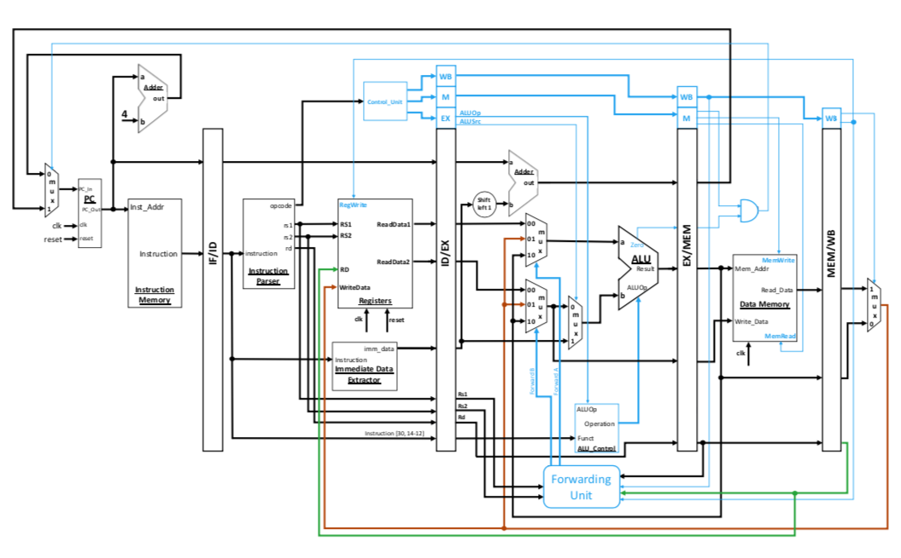

# RISC-V Processor

This is a verilog code for a 5-stage pipelined RISC-V Processor with forwarding functionality. Here is the circuit diagramme of the processor.



## Getting Started

These instructions will get you a copy of the project up and running on your local machine for development and testing purposes. See deployment for notes on how to deploy the project on a live system.

### Prerequisites

For simulation purpose, you can install ```ModelSim``` or any other simulation tool that supports Verilog HDL. 

### Installing

Once you have ```ModelSim``` launched, change your working directory to this project's directory using the following command in transcript window.

```
cwd "[/path/to/directory]/PipelinedProcessor"
```

And run the simulation by running

```
do run.do
```

After the simulation ends, you can see the simulation waves in the simulator. You can also change the hard-coded instructions from ```Instruction_Memory.v```. 

**Note**: Do not check the dependency of a load instruction result on the next instruction, as the architecture does not support stalling.

## License

This project is licensed under the MIT License - see the [LICENSE.md](LICENSE.md) file for details

## Acknowledgments

* Habib University for the course on Computer-Architecture
* @hasanbaig for step-by-step well-formatted excercises to build this circuit.

